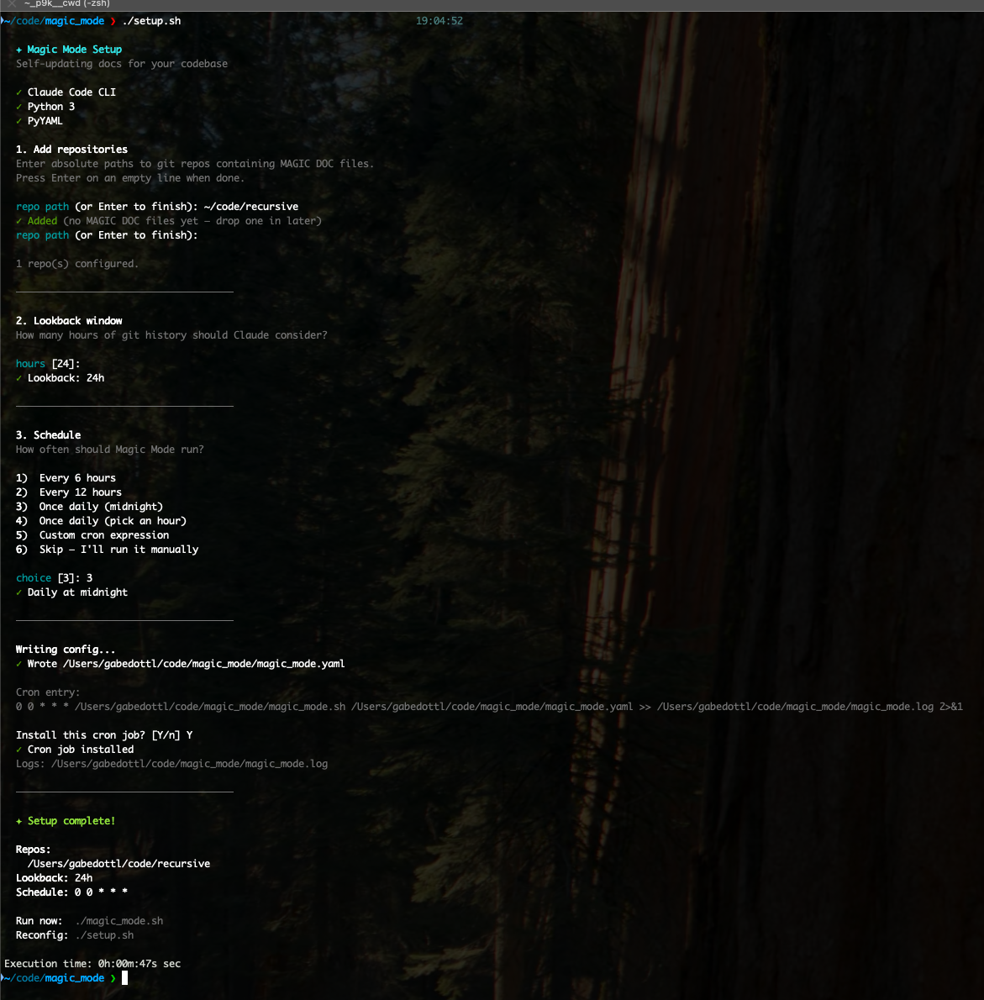

# Magic Docs

Self-updating docs for your codebase, powered by Claude Code.



## Concept

Borrowed from [Claude Code's Magic Docs](https://docs.anthropic.com) — a system where specially marked markdown files are automatically kept up to date by an AI agent based on the current state of the project and recent changes.

A file is recognized as a **Magic Doc** if its first line starts with:

```
# MAGIC DOC: Some Title
```

It can optionally have an italicized instruction line right after the header:

```
# MAGIC DOC: Architecture Overview
*Keep this focused on high-level architecture, not line-by-line code docs.*
```

Magic Docs scans your configured repos for these files, then runs Claude Code to update each one in place. The updates are:

- **Terse** — no fluff
- **Architecture-focused** — overviews, entry points, design decisions
- **Current** — reflects the actual state of the code right now
- **High-signal** — non-obvious patterns, not line-by-line documentation
- **Not a changelog** — it's a living doc, not a history

## Quick Start

```bash
./setup.sh
```

The interactive setup walks you through:
1. Adding repos to track (validates they exist and checks for existing MAGIC DOC files)
2. Setting the lookback window (how many hours of git history to consider)
3. Scheduling — pick a preset (every 6h, 12h, daily) or enter a custom cron expression

It writes `magic_docs.yaml` and optionally installs a cron job for you.

## Manual Setup

If you prefer to configure by hand:

1. Install [Claude Code](https://docs.anthropic.com/en/docs/claude-code): `npm install -g @anthropic-ai/claude-code`
2. Edit `magic_docs.yaml`:

```yaml
lookback_hours: 24
repos:
  - /path/to/your/repo
  - /path/to/another/repo
```

3. Drop `# MAGIC DOC: <title>` files into your repos (see `example_magic_doc.md`).
4. Run: `./magic_docs.sh`

## How It Works

1. Parses `magic_docs.yaml` for the list of repos and lookback window.
2. For each repo, finds all `.md` files containing a `# MAGIC DOC:` header.
3. Launches Claude Code (`--dangerously-skip-permissions`) with a prompt that:
   - Reads the git log for the last N hours
   - Explores the current repo structure
   - Updates each Magic Doc file in place
4. Claude is constrained to only edit the Magic Doc files — no other modifications.

## Example

See [`example_magic_doc.md`](./example_magic_doc.md) for a template you can drop into any repo.

## Requirements

- [Claude Code CLI](https://docs.anthropic.com/en/docs/claude-code) (`claude` command available)
- Python 3 (for YAML config parsing)
- Git repos with at least some commit history
